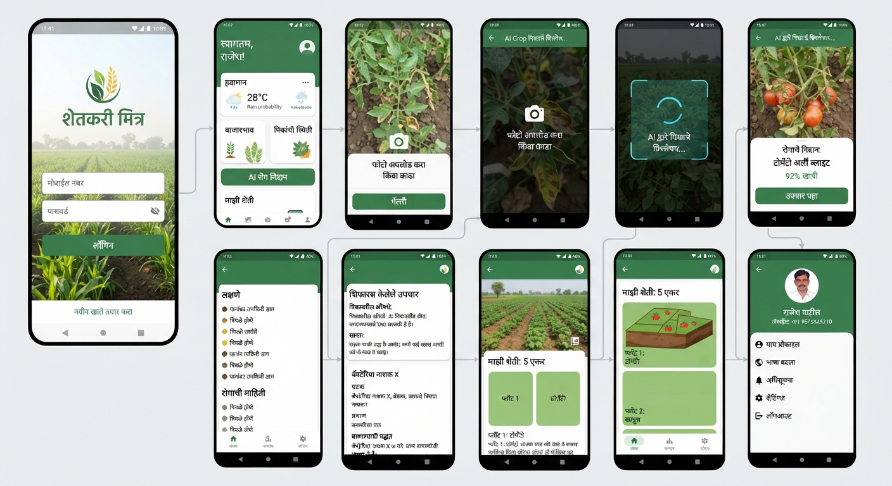
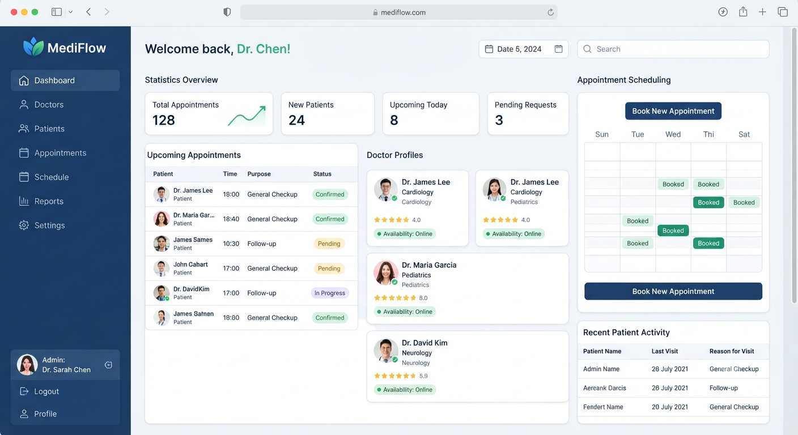
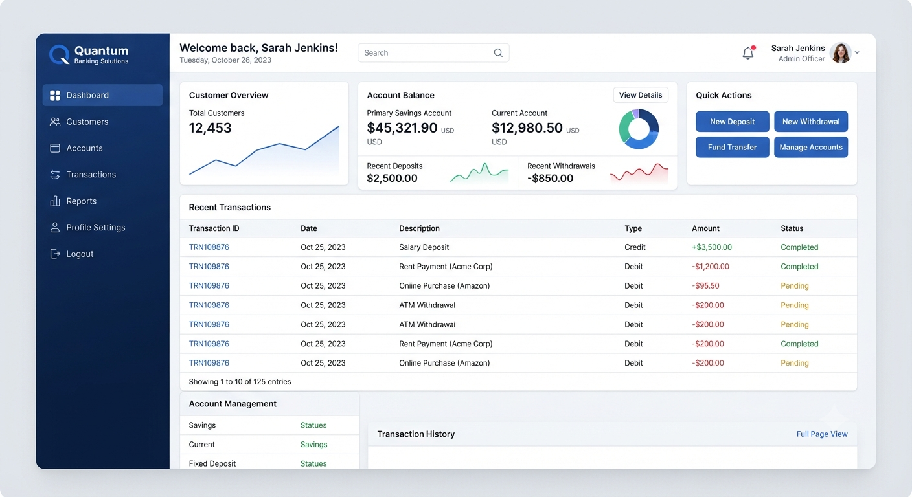
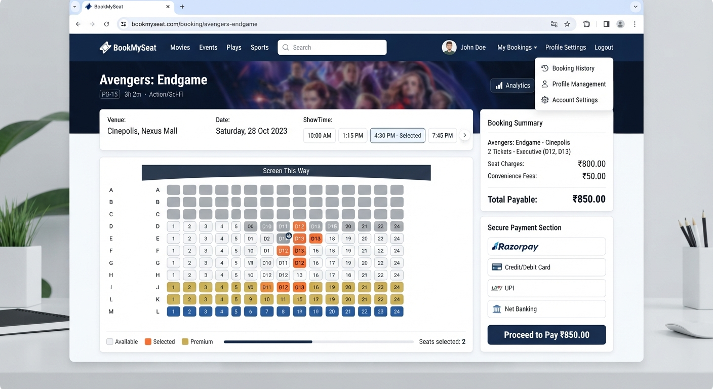
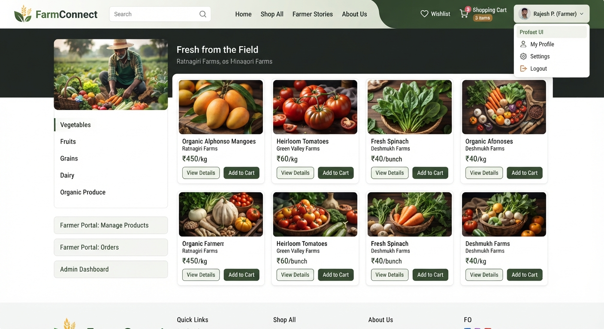

<div align="center">

# 👋 Hi, I'm Vaibhav Manohar Bawaskar

### 🚀 Full Stack Developer | Java & Spring Boot | React.js | Flutter | Django


<br><br>

**💻 Turning Ideas Into Real-World Software Solutions**

`Code` • `Build` • `Test` • `Improve` • `Deploy`

</div>

---

## 👨‍💻 About Me

I'm a passionate **Full Stack Developer** focused on building scalable, secure and user-friendly web and mobile applications.

I enjoy solving real-world problems, developing REST APIs, integrating frontend and backend systems, and continuously learning modern technologies.

| 🎓 Profile | 🎯 Focus |
|---|---|
| 🎓 MCA Graduate | 🌐 Web Development |
| 💻 Full Stack Developer | 📱 Mobile Development |
| ☕ Java & Spring Boot | 🔗 REST API Development |
| ⚛️ React.js | 🗄️ Database Management |
| 📱 Flutter & Dart | 🧪 Application Testing |
| 🐍 Python & Django | 🤖 AI & Machine Learning |

---

# 🛠️ Technical Skills

### ☕ Programming Languages


### ⚙️ Backend Development


### ⚛️ Frontend Development


### 📱 Mobile Development


### 🗄️ Databases


### 🔧 Tools & Technologies


---

# 🚀 Featured Projects

## 🌾 Farmer Marketplace

<p align="center">
  
</p>

Full-stack marketplace platform connecting **farmers and buyers**.

### 🛠️ Tech Stack

`React.js` `Spring Boot` `MySQL` `JWT` `Cloudinary` `Razorpay`

### ✨ Features

- 🔐 Role-based Authentication
- 👨‍🌾 Farmer Product Management
- 🛒 Shopping Cart
- 📦 Order Management
- 💳 Online Payments
- ☁️ Cloudinary Integration
- 👨‍💼 Admin Management

<p align="center">
  <a href="https://github.com/VaibhavBawaskar/farmer-marketplace-2026">
    💻 View Source Code
  </a>
</p>

---

## 🎟️ BookMySeat

<p align="center">
  
</p>

Online seat booking platform with payment integration and seat management.

### 🛠️ Tech Stack

`Python` `Django` `MySQL` `Razorpay`

### ✨ Features

- 🎫 Online Seat Booking
- 🔒 Seat Locking
- 💳 Razorpay Payment
- 📊 Booking Management
- 📈 Analytics
- 👤 User Management

<p align="center">
  <a href="https://move-tikit-book.onrender.com">
    🚀 Live Demo
  </a>
</p>

---

## 🏦 Bank Management System

<p align="center">
  
</p>

Banking application for managing customers, accounts and transactions.

### 🛠️ Tech Stack

`Java` `Spring Boot` `Django` `MySQL`

### ✨ Features

- 👤 Customer Management
- 🏦 Account Management
- 💰 Transaction Management
- 🔐 Authentication
- 🗄️ Database Management

---

## 🏥 Doctor Appointment Management

<p align="center">
  
</p>

Healthcare application for managing doctors, patients and appointments.

### 🛠️ Tech Stack

`Java` `Spring Boot` `React.js` `MySQL`

### ✨ Features

- 👨‍⚕️ Doctor Management
- 👤 Patient Management
- 📅 Appointment Scheduling
- 🔐 Authentication
- 🗄️ Database Management

---

## 🌱 Shetkari Mitra

<p align="center">
  
</p>

Smart agriculture application designed to help farmers with crop-related information and digital services.

### 🛠️ Tech Stack

`Flutter` `Dart` `Spring Boot` `MySQL` `AI`

### ✨ Features

- 🌾 Crop Information
- 📷 Crop Image Analysis
- 🤖 AI-Based Assistance
- 🌦️ Weather Information
- 💊 Agriculture & Medicine Information
- 👨‍🌾 Farmer Profile & Farm Management
### ✨ Features

- 📷 Crop Image Analysis
- 🌾 Crop Disease Information
- 🤖 AI Recommendations
- 🌦️ Weather Information
- 💊 Crop Medicine Information
- 👨‍🌾 Farmer Profile
- 🚜 Farm Management

---

# 💡 Development Workflow

```text
💭 Idea
   ↓
🎨 Design
   ↓
💻 Development
   ↓
🧪 Testing
   ↓
🐞 Debugging
   ↓
🚀 Deployment
   ↓
🔄 Improvement
```

---

# 🧪 Development & Testing

| 🔍 Area | 🛠️ Experience |
|---|---|
| 🔍 Application Testing | Functional Testing |
| 🧪 API Testing | REST API Validation |
| 🐞 Bug Identification | Issue Detection |
| 📋 User Story Testing | Requirement Verification |
| 🔄 API Response Validation | Data Verification |
| 🌐 Browser DevTools | Console & Network Debugging |
| 🔧 Troubleshooting | Error Analysis |
| 📊 Flow Verification | Application Flow Testing |

---

# 📚 Currently Learning

| 📚 Technology / Area | 🚀 Focus |
|---|---|
| ⚡ Flutter | Advanced Development |
| 🔄 State Management | Application State |
| 🌐 REST APIs | API Integration |
| 📦 JSON | Parsing & Data Handling |
| 🔐 Security | Secure Authentication |
| 🧩 Spring Boot | Advanced Backend |
| 🤖 Machine Learning | ML Fundamentals |
| 🌱 Crop Disease AI | AI-based Detection |
| ☁️ Cloud | Deployment & Architecture |

---

# 💡 What I Do

| 💻 Area | 🚀 Technologies |
|---|---|
| 🎨 Frontend | React.js • HTML • CSS • JavaScript |
| ⚙️ Backend | Java • Spring Boot • Django |
| 🌐 API Development | REST APIs • JSON • Postman |
| 🗄️ Databases | MySQL • MongoDB |
| 📱 Mobile | Flutter • Dart |
| 🔐 Authentication | JWT • Spring Security |
| 🧪 Testing | Application • API Testing |
| 🐞 Debugging | Bug Identification • Troubleshooting |
| 🧠 Problem Solving | Real-world Software Solutions |

---

# 🎯 Career Interests


---

# 🤝 Let's Connect

<div align="center">

<a href="https://www.linkedin.com/in/vaibhav-bawaskar-48a933319/">

</a>

<a href="https://github.com/VaibhavBawaskar">

</a>

<a href="mailto:vaibhavbawaskar7@gmail.com">

</a>

</div>

---

<div align="center">

### ⭐ Thanks for visiting my profile!

**💡 Learn • 💻 Code • 🚀 Build • 🌱 Grow**

**"Turning ideas into practical software solutions."**

### 🚀 Let's Build Something Amazing Together!

</div>
